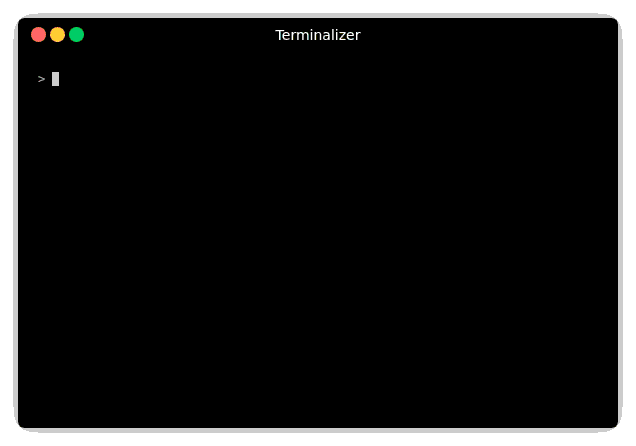

# To Do Manager CLI



This library provides a CLI tool to manage locally "to do" tasks.

## Install

```
npm install -g todo-manager-cli
```

## Usage

```
todo -h
```

### First usage example


```
# create a new flow (an editor will be open)
todo new flow -n "default"

# show current flows
todo list flows

# create a new board
todo new board default -n "My new board"

# show current boards
todo list boards

# creates a new task and attaches it to the board
todo new task -n "My very first task" -b "My new board"

# show current tasks
todo

# change task's step (status)
todo move task "first task" -s "progress"

todo
```

## Description

It uses the [npm todo-manager package](https://www.npmjs.com/package/todo-manager) to store locally the information about the "to do"s.

This utility stores the information in YAML format, so it is easy to an human to read and modify source data files, if needed.

Also, it can be configured to globally or locally, get the source data files from one or another location. So, for example, you can use this tool to manage only the tasks about your project when you are inside the project's folder.

## Configuration

First time you run the command, a configuration file will be created on `~/.config/todo-manager.yml`. This configuration can be manually edited.

### Overriding configuration

By adding the line

```
files: ["./tm.config.yml"]
```

on a configuration file, you can define a list of overriding configuration files.
If the file is found, the configuration will be override.

In this particular example, the tool will look for a local file `./tm.config.yml` with respect the location where command is launched.

In this way, if you run the command inside a project which has this file, the configuration will be overrided.

An interesting application of that is to allow some projects to use their own data files source.
